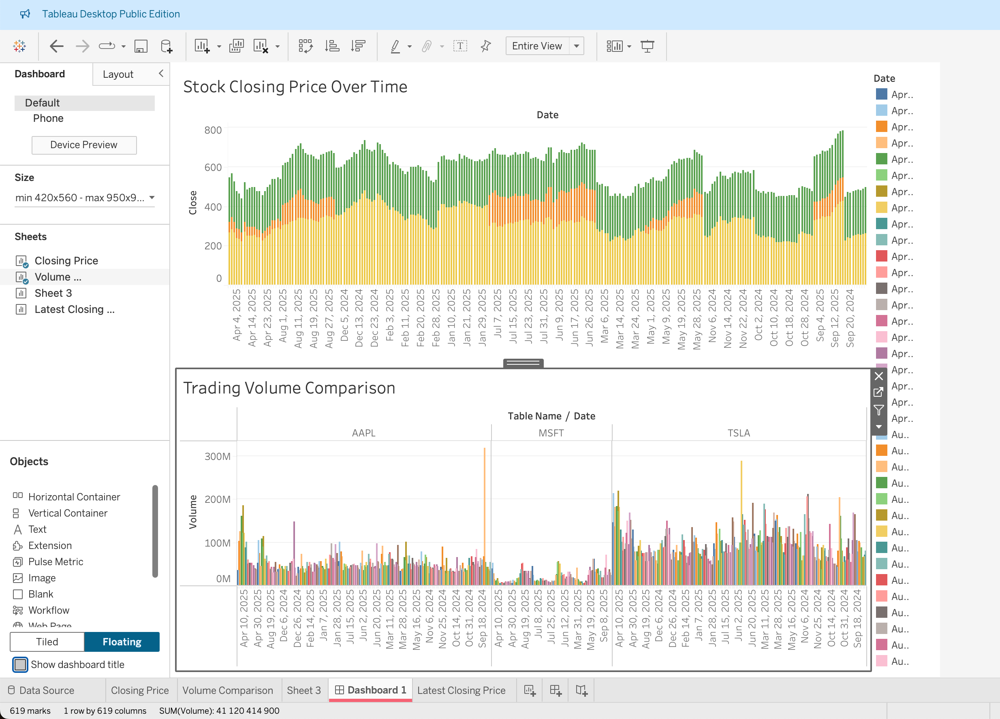

# 📊 Stock Market Dashboard (AAPL, MSFT, TSLA)

An interactive **Tableau dashboard** analyzing stock closing prices and trading volumes for Apple (AAPL), Microsoft (MSFT), and Tesla (TSLA).  
This project showcases how BI dashboards can highlight **trends, KPIs, and market comparisons** in an easy-to-digest format.

---

## 🚀 Features

- 📈 **Closing Price Trends** → Visualizes stock price movements over time.  
- 📊 **Trading Volume Comparison** → Compares trading activity across companies.  
- 🔍 **Interactive Filters** → Filter by company and time period.  
- 📌 **Summary Metrics** → Latest closing price, highest volume day, and more.  

---

## 📂 Data

- Source: Historical stock data (CSV files)  
- Files included:
  - `data/aapl.csv`
  - `data/msft.csv`
  - `data/tsla.csv`

Each file contains:
- `Date` → Trading day  
- `Close` → Closing stock price  
- `Volume` → Number of shares traded 

---

## 📸 Preview

---

## ⚡ Tech Stack

- [Tableau Public]
- GitHub for version control & sharing  
- CSV data (Apple, Microsoft, Tesla stock history)

---

## 💡 Insights

- Tesla shows **highest volatility** in stock price.  
- Apple maintains **steady volume**, with peaks around product events.  
- Microsoft’s trading volume spikes coincide with **earnings announcements**.  

---

## Author
**Keamogetswe Moseki**

